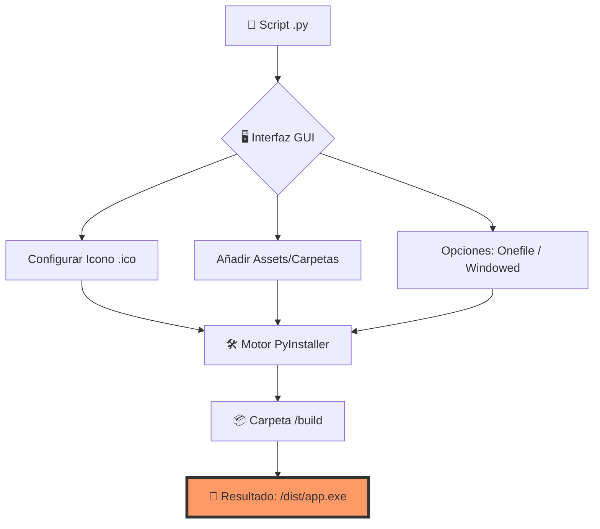

---

# 🚀 Python to EXE Compiler (GUI)


Una herramienta gráfica potente e intuitiva para convertir tus scripts de Python (`.py`) en ejecutables de Windows (`.exe`) sin tocar la terminal. Olvídate de recordar comandos largos de PyInstaller.

---

## 🔄 Flujo de Trabajo

A continuación se muestra cómo funciona el proceso de compilación internamente:



---

## ✨ Características Principales

- **📦 Onefile Mode:** Empaqueta todo en un único archivo ejecutable.
- **🪟 Windowed Mode:** Elimina la molesta consola negra (ideal para apps GUI).
- **🎨 Branding:** Soporte directo para archivos de ícono `.ico`.
- **📁 Gestión de Assets:** Interfaz para incluir archivos y carpetas extra (`--add-data`).
- **📜 Consola en Tiempo Real:** Visualiza el progreso del log de compilación dentro de la app.
- **🧹 Auto-Clean:** Limpia archivos temporales automáticamente tras la compilación.
- **🐍 Auto-Install:** Detecta y descarga PyInstaller si no está presente.

---

## 🖥️ Requisitos de Sistema

- **S.O.:** Windows 10 o 11 (Recomendado).
- **Python:** Versión 3.9 o superior.
- **Dependencias:** La aplicación instalará `pyinstaller` automáticamente al primer uso.

---

## 🚀 Guía de Uso

### 1. Preparación
Clona este repositorio o descarga el código y ejecuta:
```bash
python compilador.py
```

### 2. Configuración en la App
1.  **Select Script:** Elige tu archivo principal `.py`.
2.  **Options:**
    *   Activa **Onefile** si quieres un solo ejecutable portable.
    *   Activa **Windowed** si tu aplicación tiene su propia interfaz gráfica.
3.  **Assets (Opcional):** Agrega las carpetas de imágenes, sonidos o bases de datos que use tu script.
4.  **Icon:** Selecciona un archivo `.ico` para darle identidad a tu app.

### 3. Compilación
Haz clic en **"Compilar"**. Una vez finalizado, busca tu archivo en la carpeta `/dist`.

---

## 📂 Manejo de Archivos Extra (Assets)

Para que tu EXE encuentre los archivos incluidos (como imágenes o JSON) una vez compilado, usa esta función en tu código Python:

```python
import sys
import os

def resource_path(relative_path):
    """ Obtiene la ruta absoluta para recursos, compatible con PyInstaller """
    try:
        # PyInstaller crea una carpeta temporal en _MEIPASS
        base_path = sys._MEIPASS
    except Exception:
        base_path = os.path.abspath(".")

    return os.path.join(base_path, relative_path)

# Ejemplo de uso:
# imagen = resource_path("assets/logo.png")
```

## ⚠️ Notas Importantes

*   **Antivirus:** Algunos antivirus pueden marcar los EXE de PyInstaller como falsos positivos. Se recomienda firmar el ejecutable o añadirlo a exclusiones si es para uso interno.
*   **Iconos:** Asegúrate de que el archivo sea estrictamente formato `.ico`. Los archivos `.png` renombrados no funcionarán.
*   **Rendimiento:** La primera compilación puede tardar más debido al análisis de dependencias de Python.

---

## 🛠️ Tecnologías Usadas

*   **Python 3** - Lenguaje base.
*   **Tkinter** - Motor de la interfaz gráfica.
*   **PyInstaller** - El núcleo encargado de la compilación.
*   **Threading** - Para evitar que la interfaz se congele durante la compilación.

---
⭐ **¿Te sirvió?** ¡No olvides darle una estrella a este repositorio!
